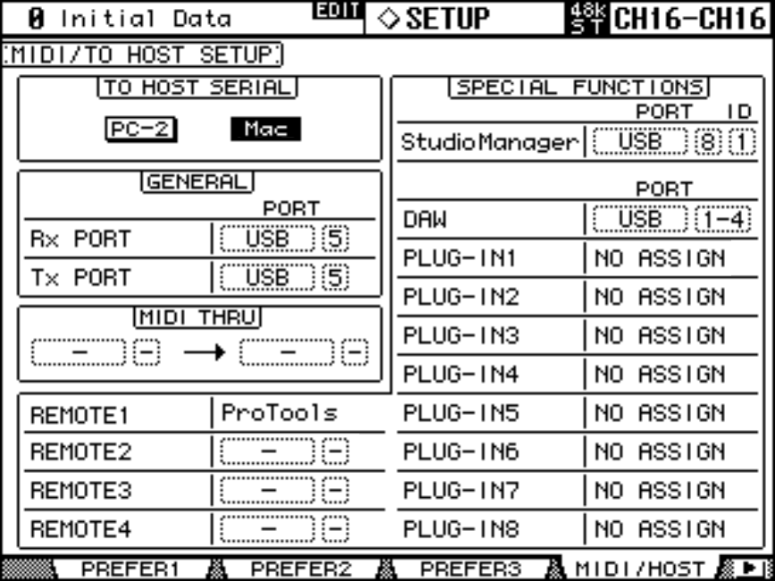
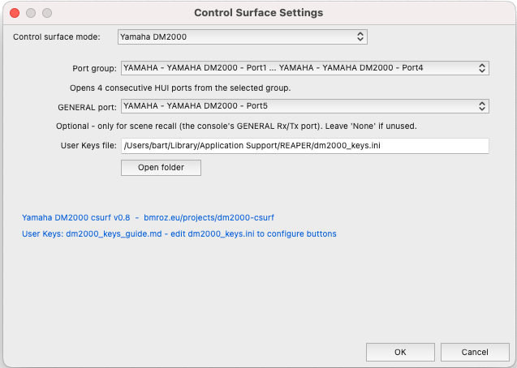

[]() []() []() []() [](https://bmroz.eu/projects/dm2000-csurf) [](https://www.gnu.org/licenses/lgpl-3.0)

# reaper_csurf_dm2000 - Yamaha DM2000 control surface for REAPER

A native REAPER control surface plugin (DLL/dylib) giving bidirectional
integration between the Yamaha DM2000 digital console and REAPER: 24
touch-sensitive faders, pan knobs, mute/solo/rec-arm/select buttons with LED
feedback, transport controls, automation mode switching, jog wheel, bank
switching, and channel-name scribble strips. The plugin speaks HUI on the
console's USB MIDI ports 1-4.

To the author's knowledge this is the first open-source DM2000 control
surface for REAPER.

**Design document:** see [DESIGN.md](DESIGN.md) for the full protocol
reference, layer plan, and task tracking.

## Hardware requirements

- Yamaha DM2000 **V2** (firmware V2.40) - V1 uses a different DAW port layout
  and is not supported
- USB connection to the PC with the Yamaha USB-MIDI driver (exposes 8 virtual
  MIDI port pairs)
- Console setup (`SETUP → MIDI/HOST SETUP`):
  - Remote Layer 1 target: **Pro Tools**
  - DAW: **USB 1-4**

  <div align="center"></div>

- Windows x64 or macOS (arm64/x86_64), REAPER 6 or later
- Note: "DAW Off-line" on the DM2000 display is normal until REAPER is running
  with the surface configured (the plugin answers the console's keepalive ping)

**DM2000 Owner's Manual (V2):** [jp.yamaha.com - DM2000V2 EN OM](https://jp.yamaha.com/files/download/other_assets/7/334227/dm2000v2_en_om_g0.pdf) - MIDI/HUI chapter 18, SysEx appendix C.

**Logic Pro Control Surfaces Support Guide - Yamaha DM2000:** [support.apple.com - logicpro-css](https://support.apple.com/guide/logicpro-css/yamaha-dm2000-ctls74ca162f/mac) - the most complete map of how the DM2000's controls behave as a DAW surface (Apple's HUI-derived implementation); used here as a cross-reference for control assignments.

**HUI Protocol Specification (Mackie HUI):** [stash.reaper.fm - HUI.pdf](https://stash.reaper.fm/12332/HUI.pdf) - the canonical reverse-engineered HUI MIDI protocol (theageman, 2010; compiled document © 2011 SSEI), the basis for the DM2000's HUI emulation and this plugin's protocol work. See [doc/hui-spec/](doc/hui-spec/HUI_SPEC_REFERENCES.md) for the mirrored `.txt` references and full credits.

## Installation (pre-built)

Download the latest release from the [Releases](../../releases) page.

**Windows:** copy `reaper_csurf_dm2000_x64.dll` to `%APPDATA%\REAPER\UserPlugins\`.

**macOS:** copy `reaper_csurf_dm2000.dylib` to `~/Library/Application Support/REAPER/UserPlugins/`.

Restart REAPER after copying.

> macOS note: the dylib is a universal binary (arm64 + x86_64), hardware-verified
> on both Intel and Apple Silicon.

**User Keys (Locate section and UDK buttons):** without `dm2000_keys.ini`,
RETURN TO ZERO and END use built-in go-to-start/end; all other Locate and
UDK buttons do nothing. See [doc/dm2000_keys_guide.md](doc/dm2000_keys_guide.md).

- **Pre-built release:** download `dm2000_keys.ini` from the
  [Releases](../../releases) page and place it in `%APPDATA%\REAPER\` (Windows)
  or `~/Library/Application Support/REAPER/` (macOS). The config dialog path
  is pre-filled to that location.
- **Building from source:** the post-build / `make install` step copies it
  automatically on first build.

## Building from source

### Windows

Prerequisites:

- Visual Studio 2019 Community or later with the
  "Desktop development with C++" workload
- REAPER Extension SDK extracted to `C:\reaper_extension_sdk\` with the
  environment variable `REAPER_EXTENSION_SDK` pointing at it
- `msbuild` on `PATH`

```powershell
cd C:\dev\reaper_csurf_vs201x
# Close REAPER first - it locks the DLL and the post-build copy will fail
msbuild Builds\VisualStudio2019\reaper_csurf.sln /p:Configuration=Debug /p:Platform=x64
```

The post-build step copies the DLL to `%APPDATA%\REAPER\UserPlugins\`.

Only the **VisualStudio2019** solution includes `csurf_dm2000.cpp`; the
2013/2015/2017 solutions are left over from the scaffold and will not link.

This project is built on the [Erriez/reaper_csurf_vs201x](https://github.com/Erriez/reaper_csurf_vs201x)
scaffold - see its README/wiki for a step-by-step Visual Studio debugging
setup (attaching to reaper.exe, breakpoints, etc.).

### macOS

See [MACOS_BUILD.md](MACOS_BUILD.md) for the full procedure (prerequisites,
WDL clone, `make`, binary verification, install).

## REAPER configuration

1. `Preferences → Control/OSC/web → Add → "Yamaha DM2000"`.
2. In the surface settings, pick the **port group** - with the default console
   setup that is the entry reading `Yamaha DM2000-1 ... Yamaha DM2000-4`.
   The plugin opens 4 consecutive HUI ports from that selection.
3. *(Optional)* Pick a **GENERAL port** for scene recall - a separate, unused USB port
   set as the console's GENERAL Rx/Tx (`SETUP → MIDI/HOST SETUP → GENERAL`). Leave it on
   "None" if you don't use scene recall. See [Scene recall](#scene-recall-general-port).
4. The **User Keys file** path is pre-filled with the default `dm2000_keys.ini`
   location. Edit that file to configure Locate section and UDK button actions;
   see [doc/dm2000_keys_guide.md](doc/dm2000_keys_guide.md) for the full reference.
5. OK.

<table align="center"><tr>
<td align="center"><br><sub>Windows</sub></td>
<td align="center"><br><sub>macOS</sub></td>
</tr></table>

## Feature status

### Layer 1 - HUI core: complete

- 4-port MIDI open/close, keepalive ping echo, config dialog
- Faders both directions, touch detect (touch automation works)
- Mute / solo / rec-arm / select buttons with LED feedback
- Transport (play/stop/record/rewind/forward, RETURN TO ZERO, END, LOOP) with LEDs
- Bank switching (channel +-1, bank +-24)
- Automation modes: the AUTOMIX section sets the **selected tracks'** automation mode (Trim / Read / Touch / Latch / Write) with LED feedback

### Layer 2 - Channel strip feedback: complete (hardware-tested)

- [x] Pan: knob input (relative v-pot deltas), ring-LED feedback, knob press centers pan
- [x] Selected channel highlight; SEL is exclusive by default (single press selects only that
      track, hold to multi-select - Pro Tools-style), set `[select] exclusive = 0` for additive
- [x] Jog wheel moves the edit cursor (speed-scaled, 1-6)
- [x] 4-char track names on scribble strips (HUI SysEx)
- [x] VU meters on channel strips (100ms peak polling, 3-cycle peak hold,
      red OVER only above 0 dBFS - matches REAPER's clip indication)
- [x] Locate section buttons (fully configurable via `[locate]` in `dm2000_keys.ini`):
      - Row 2: RETURN TO ZERO (go to project start), END (go to project end),
        LOOP (toggle repeat with LED feedback), QUICK PUNCH (insert marker).
        ONLINE, SET/REHEARSAL/MTR/MASTER: no HUI output - DM2000 internal only.
      - Row 1: IN (set loop in-point), OUT (set loop out-point),
        POST (insert region from time selection). AUDITION/PRE: no default action.
      - LOCATE MEMORY 1-8: jump to REAPER markers 1-8. Configurable via dm2000_keys.ini.
- [x] BACK button -> undo; FORWARD -> redo.
- [x] ENTER button toggles cursor arrows between two modes: scroll (NAVIGATION) and zoom (ZOOM).
- [x] REW/FF support auto-repeat when held, same as cursor arrows.
- [x] AUTO button (per-channel) cycles that track's automation mode by default (`[channel] auto_button`; `unity` instead resets the fader to 0 dB).
- [x] Scrub wheel speed increased (10x); jog wheel unchanged.
- [x] Scene recall (bidirectional): a DM2000 scene recall jumps REAPER to the matching
      marker, and `#SCENE` markers drive the console as playback crosses them (recall while
      playing, scroll-only while stopped) - over a dedicated GENERAL port chosen in the
      config dialog. Optional; see [Scene recall](#scene-recall-general-port) below
- [x] LED counter display: timecode position sent to the front-panel counter at a configurable
      rate (default 33 ms ≈ 30 Hz). Follows REAPER's transport display format setting
      (right-click transport).

Full button/zone/MIDI reference: [DESIGN.md - Button / function / MIDI reference table](DESIGN.md#button--function--midi-reference-table).

### DM2000-specific behavior (hardware-verified - details in DESIGN.md)

- **Fader taper is calibrated to the console's printed scale**: REAPER dB and
  the printed marks agree along the throw (11-point piecewise-linear table from
  DM2000 Editor captures, post-fader-calibration).
- **The console's fader physical maximum is the printed +10 mark** (wire value
  16383). REAPER volumes above +10 dB clamp to that position.
- The console keeps an internal model of DAW fader positions and springs motors
  back to it on release; the plugin echoes every received fader move to keep that
  model in sync.
- On close, the plugin drives all faders to -inf, then clears meters, LEDs, pan rings, and scribbles.

### Layer 3 - extended SysEx: partial

- [x] **Scene recall** (GENERAL port) - bidirectional. See
      [Scene recall](#scene-recall-general-port) below. Full SysEx scene *dump/restore* (an
      entire scene's contents) is out of scope - PC recall covers the live workflow.
- [x] Meter bridge - driven by existing HUI meter messages (Layer 2); no native SysEx needed
- **Channel names via native SysEx (port 8) - investigated, not pursued.** Format captured and
  code written, but a hardware test settled it: in DAW mode the visible scribble strip is
  HUI-controlled and 4 chars wide regardless; native SysEx updates only the console's internal
  name memory, not the DAW-layer display. Left inactive (`m_midiout8` stays NULL) - wiring port 8
  wouldn't change what's shown.

### Layer 4 - partial (new in v0.6)

- **USER DEFINED KEYS** - all 16 UDK buttons fire configurable REAPER actions
  via the `[udk]` section of `dm2000_keys.ini`.
- **Surround pan** - the DYNAMICS knobs and surround joystick (port 4) drive a
  surround plugin on the selected track, configured via `[surround]` (ships
  targeting ReaSurroundPan; no compiled-in default). Hardware-verified.
- **FX parameter editor** - the EFFECTS/PLUG-INS section plus the parameter knobs
  and page arrows edit any FX on the selected track; param names and values are
  shown on the REMOTE INSERT ASSIGN/EDIT screen above the four knobs. Hardware-verified.

### Layer 4 - new in v0.8

- **Encoder sends** - the AUX SELECT 1-5 buttons switch the channel encoders to ride
  REAPER track send levels (send 1-5), with V-pot ring feedback and the destination
  name on the strips; ENC PAN returns to pan. Mirrors the desk's native AUX A-E
  encoder send-level behaviour. Toggle with `[encoder] sends`.
- **Status icons** - the per-channel **INS** icon lights when a track has any FX, and
  the **AUTO** indicator lights for any active automation mode - green=Read, orange=Touch/Latch,
  red=Write (dark in Trim/off). Toggle with `[display] insert_icon` / `auto_indicator`.
- **Scribble peeks** - hold ENC ASSIGN 1 to momentarily overlay each track's **number**,
  or ENC ASSIGN 2 for each fader's level in **dB** (live); release to restore names.
  Toggle with `[display] peek_number` / `peek_db`.
- **SELECT ASSIGN readout** - the master-section SELECT ASSIGN field now tracks the encoder
  mode: **Pan** in pan mode, **SndA**-**SndE** when the encoders ride sends. (Recovered by
  sniffing Pro Tools; it's scribble cell 8 on port 1 - see DESIGN.md.)
- **CURSOR MODE readout** - shows **NAVIGATION** / **ZOOM** following the ENTER arrow-mode
  (scroll → NAVIGATION, zoom → ZOOM). Pro Tools' third mode, SELECT, is omitted - it's a
  transient console state with no matching arrow behaviour in REAPER.
- **EFFECTS/PLUG-INS rings & window** - the four parameter-knob rings show the visible
  parameters' values, and moving a knob floats that plug-in's window (`[fx] window_on_knob`);
  the EFFECTS **DISPLAY** button toggles that auto-float on the fly.
- **V-pot ring blink** - in AUX/send mode, the rings of channels that carry the ridden send
  blink, setting them apart from pan.
- **counter-mode LEDs** - the **TIME CODE / FEET / BEATS** indicators follow REAPER's timecode format.
- **AUTO key & double-tap** - the per-channel **AUTO** key cycles automation mode (`[channel]
  auto_button`; Off→Read→Touch→Latch→Write) with a colour indicator that **blinks in Latch**;
  double-tapping a fader snaps it to 0 dB (`[channel] double_touch`).
- **Startup splash** - on load the REMOTE display briefly shows `DM2000 csurf online vX.Y` and the
  project website, then hands off to the FX view - clearing the console's "Off-Line" message.

### Layer 4 - new in v0.9

- **FLIP** (FADER MODE button) - while the encoders ride a send, FLIP swaps them: the
  motorized faders ride the selected send (calibrated taper) and the encoders/rings ride
  volume; press again to swap back. The FADER / AUX-MTRX LED tracks it. Toggle with `[fader] flip`.
- **2x40 display overlays** - momentary readouts on the big REMOTE display, then it reverts to
  the FX view: full **track name** on SEL (vs the 4-char strip); **FX name + bank range + the
  4 param names** on FX-slot / param-page change and the window toggle; **scene / marker name**
  on recall; **send destination** on AUX SELECT. Each `[display]`-configurable.
- **Polish / accented track names** - non-ASCII scribble names are transliterated to ASCII
  (ł→l, ó→o, ż→z, é→e, ...) so they show meaningfully instead of being dropped.

Everything above is configurable in `dm2000_keys.ini`; defaults are documented in
[doc/dm2000_keys.ini.example](doc/dm2000_keys.ini.example) and
[doc/dm2000_keys_guide.md](doc/dm2000_keys_guide.md).

Still to come: talkback / control-room (via the native SysEx layer - see
[doc/dm2000-native-sysex.md](doc/dm2000-native-sysex.md)). (The DM2000's EQ / SELECTED CHANNEL
knobs send no MIDI on any port, so EQ isn't controllable from the surface - see Known limitations.)
See [DESIGN.md](DESIGN.md).

## Scene recall (GENERAL port)

*New in v0.7. Optional - does nothing unless you set it up.* Links REAPER project markers to DM2000
scene memories, both directions, over the console's **GENERAL Rx/Tx port**. That must be a
separate, unused USB port (the console won't share a DAW port number with GENERAL). Set the
GENERAL port on the console (`SETUP → MIDI/HOST SETUP → GENERAL`), pick that same port in the
config dialog's **GENERAL port** dropdown, then enable it in `[scene]` of `dm2000_keys.ini`:

- **Receive** (default on) - recalling a scene on the desk jumps REAPER to the marker
  *numbered* the same (scene 4 → marker 4; matched by number, since marker names can repeat).
- **Send** (default off) - markers drive the desk as playback crosses them:
  - `#SCENE 4 Chorus` → scene 4 (any text after the number is a free label)
  - recall vs. scroll is by transport state: crossing the marker **while playing** recalls the
    scene; **while stopped** it only scrolls the desk's scene display
  - `follow_cursor` optionally makes the desk track the edit cursor while stopped

Also enable **Program Change Tx + Rx** on the desk (DISPLAY ACCESS [MIDI] → MIDI Setup) - Rx is
on by default but **Tx ships off**, so *receive* won't work until you turn it on. Scene N ↔
Program Change #N (the console's default Program Change Assign Table).

Scenes 1-99. Full reference: [doc/dm2000_keys_guide.md](doc/dm2000_keys_guide.md).

## Known limitations

- **Port 4 (MCS PANNER) partial** - the surround joystick and dynamics knobs drive a
  surround plugin (Layer 4, via `[surround]`), the ROUTING buttons 1-8 / Direct select
  which object, and the selected button's LED lights to show it. The MCS PANNER
  surround-divergence and routing/assign modes are not implemented.
- **macOS** - universal (arm64 + x86_64) SWELL build, hardware-verified on macOS each release
  alongside Windows. See [MACOS_BUILD.md](MACOS_BUILD.md).
- **Scribble strips show 4 characters only** - hardware-verified; the display is
  4-char wide in DAW mode regardless of what native SysEx sends.
- **Scene recall** - bidirectional and hardware-verified (see [Scene recall](#scene-recall-general-port)),
  but only PC recall/scroll: full SysEx scene *dump/restore* (reading/writing an entire scene's
  contents) is not implemented. Needs a GENERAL port set on the console and in the config dialog.

## License

LGPL v3. See [LICENSE](LICENSE).

## Contact

Bartłomiej Mróz · bartlomiej.mroz@pg.edu.pl · Department of Multimedia Systems, Gdańsk University of Technology · [bmroz.eu](https://bmroz.eu)
