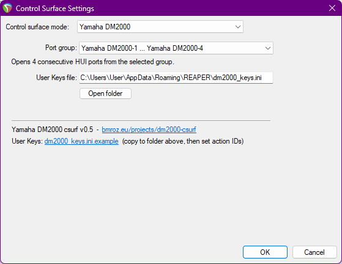

[]() []() []() []() [](https://bmroz.eu/projects/dm2000-csurf) [](https://www.gnu.org/licenses/lgpl-3.0)

# reaper_csurf_dm2000 - Yamaha DM2000 control surface for REAPER

A native REAPER control surface plugin (DLL/dylib) giving bidirectional
integration between the Yamaha DM2000 digital console and REAPER: 24
touch-sensitive faders, pan knobs, mute/solo/rec-arm/select buttons with LED
feedback, transport controls, automation mode switching, jog wheel, bank
switching, and channel-name scribble strips. The plugin speaks HUI on the
console's USB MIDI ports 1-4, with native Yamaha SysEx on a configurable
port 8 output for channel names.

To our knowledge this is the first open-source DM2000 control surface for
REAPER.

**Design document:** see [DESIGN.md](DESIGN.md) for the full protocol
reference, layer plan, and task tracking.

## Hardware requirements

- Yamaha DM2000 **V2** (firmware V2.40) - V1 uses a different DAW port layout
  and is not supported
- USB connection to the PC with the Yamaha USB-MIDI driver (exposes 8 virtual
  MIDI port pairs)
- Console setup:
  - Remote Layer target: **Pro Tools**
  - `SETUP → MIDI/HOST SETUP → DAW = USB 1-4`
- Windows x64 or macOS (arm64/x86_64), REAPER 6 or later
- Note: "DAW Off-line" on the DM2000 display is normal until REAPER is running
  with the surface configured (the plugin answers the console's keepalive ping)

**DM2000 Owner's Manual (V2):** [jp.yamaha.com - DM2000V2 EN OM](https://jp.yamaha.com/files/download/other_assets/7/334227/dm2000v2_en_om_g0.pdf) - MIDI/HUI chapter 18, SysEx appendix C.

## Installation (pre-built)

Download the latest release from the [Releases](../../releases) page.

**Windows:** copy `reaper_csurf_dm2000_x64.dll` to `%APPDATA%\REAPER\UserPlugins\`.

**macOS:** copy `reaper_csurf_dm2000.dylib` to `~/Library/Application Support/REAPER/UserPlugins/`.

Restart REAPER after copying.

> macOS note: the dylib is a universal binary (arm64 + x86_64). Hardware-verified
> with a connected DM2000 on 2026-06-15 (v0.3); all features work on macOS.

## Building from source

### Windows

Prerequisites:

- Visual Studio 2019 Community or later with the
  "Desktop development with C++" workload
- REAPER Extension SDK extracted to `C:\reaper_extension_sdk\` with the
  environment variable `REAPER_EXTENSION_SDK` pointing at it
- `msbuild` on `PATH`

```powershell
cd C:\dev\reaper_csurf_vs201x
# Close REAPER first - it locks the DLL and the post-build copy will fail
msbuild Builds\VisualStudio2019\reaper_csurf.sln /p:Configuration=Debug /p:Platform=x64
```

The post-build step copies the DLL to `%APPDATA%\REAPER\UserPlugins\`.

Only the **VisualStudio2019** solution includes `csurf_dm2000.cpp`; the
2013/2015/2017 solutions are left over from the scaffold and will not link.

This project is built on the [Erriez/reaper_csurf_vs201x](https://github.com/Erriez/reaper_csurf_vs201x)
scaffold - see its README/wiki for a step-by-step Visual Studio debugging
setup (attaching to reaper.exe, breakpoints, etc.).

### macOS

See [MACOS_BUILD.md](MACOS_BUILD.md) for the full procedure (prerequisites,
WDL clone, `make`, binary verification, install).

## REAPER configuration

1. `Preferences → Control/OSC/web → Add → "Yamaha DM2000"`.
2. In the surface settings, pick the **port group** - with the default console
   setup that is the entry reading `Yamaha DM2000-1 ... Yamaha DM2000-4`.
   The plugin opens 4 consecutive HUI ports from that selection.
3. OK.

<p align="center"></p>

## Feature status

### Layer 1 - HUI core: complete

- 4-port MIDI open/close, keepalive ping echo, config dialog
- Faders both directions, touch detect (touch automation works)
- Mute / solo / rec-arm / select buttons with LED feedback
- Transport (play/stop/record/rewind/forward, RTZ, END, LOOP) with LEDs; all switch positions
  hardware-verified 2026-06-15 (RTZ/END/LOOP are zone 0x10 sw0/1/2, not zone 0x0E)
- Bank switching (channel +-1, bank +-24)
- Automation modes: AUTOMIX section buttons control REAPER's global automation override (read/touch/write/latch/latch preview/bypass), with LED feedback; all sw assignments hardware-verified 2026-06-15

### Layer 2 - Channel strip feedback: complete (hardware-tested)

- [x] Pan: knob input (relative v-pot deltas), ring-LED feedback, knob press centers pan
- [x] Selected channel highlight
- [x] Jog wheel moves the edit cursor (speed-scaled, 1-6)
- [x] 4-char track names on scribble strips (HUI SysEx)
- [x] VU meters on channel strips (100ms peak polling, 3-cycle peak hold,
      red OVER only above 0 dBFS - matches REAPER's clip indication)
- [x] Transport extensions: RTZ/END/LOOP buttons wired to zone 0x10 sw0/1/2;
      LOOP LED feedback via `SetRepeatState`; all hardware-verified 2026-06-15.
- [x] BACK button (zone 0x08 sw2) -> undo; FORWARD (zone 0x08 sw6) -> redo.
- [x] ENTER button (zone 0x14 sw0) toggles cursor arrows between scroll and zoom mode.
- [x] QUICK PUNCH button (zone 0x10 sw3) inserts a marker at the edit cursor (action 40157).
- [x] REW/FF (zone 0x0E sw1/sw2) support auto-repeat when held (400 ms delay, 80 ms interval), same as cursor arrows.
- [x] LOCATE MEMORY 1-6 jump to REAPER markers 1-6 (zone 0x13; hardware-verified
      2026-06-15; sw mapping is non-sequential: LM1=sw1, LM2=sw3, LM3=sw6, etc.)
- [x] Scene recall: DM2000 scenes 1-99 jump to REAPER markers 1-99 via Program
      Change on the GENERAL port (0-indexed wire format per manual p.370, unverified)
- [ ] LED counter display: position sent every 100ms as HUI SysEx
      (`F0 00 00 66 05 00 11 <8 chars> F7`). Implemented but unverified on
      hardware - counter should track playback position; format may need adjustment.

Full button/zone/MIDI reference: [DESIGN.md - Button / function / MIDI reference table](DESIGN.md#button--function--midi-reference-table).

### DM2000-specific behavior (hardware-verified - details in DESIGN.md)

- **Fader taper is calibrated to the console's printed scale**: REAPER dB and
  the printed marks agree along the throw (11-point piecewise-linear table from
  DM2000 Editor captures, post-fader-calibration, 2026-06-15).
- **The console's fader physical maximum is the printed +10 mark** (wire value
  16383). REAPER volumes above +10 dB clamp to that position.
- The console keeps an internal model of DAW fader positions and springs motors
  back to it on release; the plugin echoes every received fader move to keep that
  model in sync.
- On close, the plugin drives all faders to -inf, then clears meters, LEDs, pan rings, and scribbles.

### Layer 3 - Native SysEx (port 8): partial

- SysEx output port is user-configured (config dialog SysEx dropdown)
- [x] Channel names via native SysEx - format captured 2026-06-12; sends pos=0..7 alongside HUI 4-char names; hardware-tested: scribble strip remains 4-char wide in DAW mode (physical limit)
- [x] Meter bridge - driven by existing HUI meter messages (Layer 2); no native SysEx needed
- [~] Scene recall: PC receive implemented (DM2000 scene change → REAPER marker jump for
      scenes 1-9); set GENERAL port to a DAW USB port on the console. PC send and SysEx
      scene dump not yet implemented.

### Layer 4 - future

EQ/dynamics parameter control, sends, surround panner joystick, talkback,
USER DEFINED KEYS. See [DESIGN.md](DESIGN.md).

## Known limitations

- **Port 4 (MCS PANNER) not implemented** - port 4 is opened and keepalive-echoed
  but the MCS PANNER protocol (surround joystick) is not yet implemented.
- **macOS hardware-verified** - universal (arm64 + x86_64) build verified with a
  connected DM2000 on 2026-06-15 (v0.3). See [MACOS_BUILD.md](MACOS_BUILD.md)
  for build instructions.
- **Scribble strips show 4 characters only** - hardware-verified; the display is
  4-char wide in DAW mode regardless of what native SysEx sends.
- **Scene recall partial** - PC receive is implemented (DM2000 scene recall sends PC on the
  GENERAL port → REAPER jumps to the matching marker); user must set GENERAL to a DAW USB
  port. PC send and SysEx scene dump not yet implemented.

## License

LGPL v3. See [LICENSE](LICENSE).

## Contact

Bartłomiej Mróz · bartlomiej.mroz@pg.edu.pl · Department of Multimedia Systems, Gdańsk University of Technology · [bmroz.eu](https://bmroz.eu)
