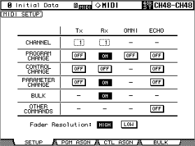
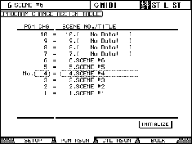

# dm2000_keys.ini guide

This guide explains how to configure the `dm2000_keys.ini` file that controls
which REAPER actions the DM2000 Locate Memory and User Defined Key buttons
trigger.

## Where the file lives

The build/install step places `dm2000_keys.ini.example` in REAPER's resource
folder as `dm2000_keys.ini` if the file does not already exist:

- Windows: `%APPDATA%\REAPER\dm2000_keys.ini`
- macOS: `~/Library/Application Support/REAPER/dm2000_keys.ini`

The plugin looks there by default. You can override the path in the DM2000
config dialog (REAPER Preferences > Control Surfaces > DM2000 > Configure).

## Finding REAPER action IDs

1. In REAPER: **Actions > Show action list**
2. Search for the action by name
3. Right-click the action > **Copy selected action command ID**
4. Paste the number into the ini file

The same list includes SWS/ReaPack actions once those extensions are installed.
Action IDs are integers; the ini file uses decimal format.

## File format

```ini
[locate]
key = action_id

[udk]
key = action_id
```

- `0` disables the button (silently ignored)
- Omitting a key uses the compiled-in default (RETURN TO ZERO/END use the API;
  all others default to 0)
- Lines starting with `;` are comments

## [locate] section - button reference

The **Default** column below shows the value shipped in `dm2000_keys.ini.example`.
The plugin's compiled-in default for every button is `0` (no action; RETURN TO
ZERO and END fall back to the go-to-start/end API) - the meaningful action IDs
come from the example ini, not the binary.

### Row 2 (above transport)

| Key | Button | Default | Notes |
|-----|--------|---------|-------|
| `rtz` | RETURN TO ZERO | 0 (GoStart API) | Returns playhead to project start |
| `end` | END | 0 (GoEnd API) | Moves playhead to project end |
| `online` | ONLINE | 0 | No standard REAPER equivalent; repurpose freely |
| `loop` | LOOP | 1068 | Toggles repeat mode |
| `qpunch` | QUICK PUNCH | 40157 | Insert marker (default); see alternatives below |

### Row 1

| Key | Button | Default | Notes |
|-----|--------|---------|-------|
| `audition` | AUDITION | 0 | No standard REAPER equivalent; repurpose freely |
| `pre` | PRE | 0 | No standard REAPER equivalent; repurpose freely |
| `in` | IN | 40222 | Set loop start point |
| `out` | OUT | 40223 | Set loop end point |
| `post` | POST | 40174 | Insert region from time selection |

### Locate Memory buttons

| Key | Button | Default |
|-----|--------|---------|
| `lm1` - `lm8` | LM1 - LM8 | 40161 - 40168 (Go to markers 1-8) |

## Useful action IDs

Verify these in your REAPER version via the action list - IDs are stable across
versions but worth confirming.

### Transport and navigation

| ID | Name |
|----|------|
| 40042 | Transport: Go to start of project |
| 40043 | Transport: Go to end of project |
| 40044 | Transport: Play/stop |
| 40046 | Transport: Play (with pre-roll) |
| 1068 | Transport: Toggle repeat |
| 40172 | Transport: Toggle auto-punch record mode |
| 40364 | Transport: Toggle loop points with time selection |

### Loop points

| ID | Name |
|----|------|
| 40222 | Transport: Set loop start point |
| 40223 | Transport: Set loop end point |

### Markers

| ID | Name |
|----|------|
| 40157 | Insert marker at current position |
| 40171 | Insert time signature marker at current position |
| 40174 | Insert region from time selection |
| 40161 | Go to marker 1 (40162-40168 for markers 2-8) |

### Editing

| ID | Name |
|----|------|
| 40029 | Edit: Undo |
| 40030 | Edit: Redo |
| 40022 | File: Save project |

### Track

| ID | Name |
|----|------|
| 40182 | Track: Toggle mute for selected tracks |

## Example configurations

### REAPER-native (default in dm2000_keys.ini.example)

Locate buttons follow REAPER conventions: IN/OUT set loop points, LM1-8 jump
to markers, LOOP toggles repeat, QPUNCH inserts a marker.

### Pro Tools-style

Buttons match what they do in Pro Tools:

```ini
[locate]
rtz     = 0       ; go to start (same as default)
end     = 0       ; go to end (same as default)
loop    = 1068    ; toggle loop (same as default)
qpunch  = 40172   ; toggle auto-punch instead of insert marker
in      = 40222   ; set loop start (same as default)
out     = 40223   ; set loop end (same as default)
post    = 0       ; disable POST (Pro Tools uses it for post-roll, no equivalent)
lm1     = 40161   ; go to marker 1 (same as default)
; ... lm2-lm8 same
```

### Minimal - only essential buttons active

```ini
[locate]
rtz    = 0      ; go to start
end    = 0      ; go to end
loop   = 1068   ; toggle repeat
in     = 40222  ; set loop start
out    = 40223  ; set loop end
; everything else = 0 (disabled)
```

## [udk] section - User Defined Keys

The UDK dispatcher is implemented. Each `keyN = action_id` maps User Defined Key
N (1-16) to a REAPER action fired via `Main_OnCommand` on press; `0` or an omitted
key does nothing.

| Key | UDK | Zone/sw | | Key | UDK | Zone/sw |
|-----|-----|---------|---|-----|-----|---------|
| `key1` | 1 | 0x09 sw2 | | `key9` | 9 | 0x09 sw0 |
| `key2` | 2 | 0x0A sw1 (BANK ◄) | | `key10` | 10 | 0x0A sw0 (CH ◄) |
| `key3` | 3 | 0x0A sw3 (BANK ►) | | `key11` | 11 | 0x0A sw2 (CH ►) |
| `key4` | 4 | 0x08 sw1 | | `key12` | 12 | 0x08 sw0 |
| `key5` | 5 | 0x08 sw5 | | `key13` | 13 | 0x08 sw4 |
| `key6` | 6 | 0x19 sw5 | | `key14` | 14 | 0x19 sw1 |
| `key7` | 7 | 0x19 sw3 | | `key15` | 15 | 0x08 sw3 |
| `key8` | 8 | 0x19 sw4 | | `key16` | 16 | 0x08 sw7 |

All 16 buttons are hardware-verified (2026-06-16 full in-order capture) and
dispatchable.

**Navigation fallback:** UDK 2/3/10/11 are physically the **BANK ◄/►** and **CH
◄/►** buttons, which move the fader bank by default. They keep that behavior
*unless* you set the matching key here - then your action overrides navigation on
that one button. Leave them unset to keep banking.

Zone/switch assignments are also documented in `dm2000_keys.ini.example` and
`DESIGN.md`.

## [counter] section - LED timecode refresh

`refresh_ms` sets how often the 8-digit LED timecode display repaints (20-1000 ms,
default 33 ≈ 30 Hz). The default gives smooth SMPTE frame counting; only digits
that changed are transmitted, so a fast refresh costs little. Raise it (e.g. 100)
to cut MIDI traffic if you only show minutes:seconds.

```ini
[counter]
refresh_ms = 33
```

## [surround] section - MCS PANNER surround pan

In Pro Tools mode the DM2000 **DYNAMICS** knobs and the **surround joystick**
(USB port 4) drive a surround plugin on the *selected* track - they never insert
one. Configure which plugin and which of its parameters each control moves:

| Key | Control | Default | ReaSurroundPan param |
|-----|---------|---------|----------------------|
| `plugin` | FX name to match (`TrackFX_GetByName`) | `ReaSurroundPan` | - |
| `param_front` | THRESHOLD knob + joystick Y | 8 | in 1 Y (front/back) |
| `param_rear` | ATTACK knob | 9 | in 1 Z (height) |
| `param_lr` | DECAY knob + joystick X | 7 | in 1 X (left/right) |
| `param_lfe` | RANGE knob | 10 | in 1 LFE |
| `param_vol` | HOLD knob | 6 | in 1 gain |

The compiled-in default is **none** - without a `[surround]` section the MCS
PANNER controls do nothing (same convention as `[locate]`/`[udk]`). The values
below ship in `dm2000_keys.ini.example` and target **input 1** of a stock
ReaSurroundPan. The `param_*` values are plain parameter indices - change them
for a different plugin, a different input, or a different feel. To discover
indices, select a track that has the plugin and press **UDK 16** with no `key16`
mapping: the plugin prints every parameter index and name to the REAPER console
(`View > Console`).

```ini
[surround]
plugin = ReaSurroundPan
param_front = 8
param_rear  = 9
param_lr    = 7
param_lfe   = 10
param_vol   = 6
stride  = 9   ; params per object (see below)
objects = 0   ; 0 = auto-detect input count from the plugin
```

### Switching the controlled object (ROUTING buttons + Direct)

The `param_*` above are **object 1**. The **ROUTING buttons 1-8** select object 1-8
within the current bank - each adds `(object-1) x stride` to every `param_*` index.
The **Direct** button shifts the bank of 8: **single press = up** (objects 9-16,
17-24...), **double press = down** (no wrapping, so it scales to Atmos-size sessions).

- `stride` = the panner's parameters-per-object. ReaSurroundPan is **9** (gain, X, Y,
  Z, LFE, divergence, delay, mute, solo). `0` disables object switching.
- `objects` = top clamp on the object count. **`0` = auto-detect** from the plugin's
  `in N` inputs (recommended - adapts as you add objects); a non-zero value forces a fixed
  count (for panners whose inputs aren't named `in N`).

The selected object's ROUTING button lights to show the selection (and clears when the
selected track has no panner). For console logging of the param/object changes while
mapping, set `console = 1` under `[debug]`; otherwise it stays quiet.

## [select] section - channel SELECT behaviour

| Key | Default | Meaning |
|-----|---------|---------|
| `exclusive` | `1` (on) | A single **SEL** selects only that track (Pro Tools-style); hold one SEL and press others to select several at once. |
| `exclusive` | `0` | REAPER's additive toggle - each SEL press adds/removes that track from the selection. |

```ini
[select]
exclusive = 1
```

## [display] section - channel icons and scribble peeks

The small per-channel display above each fader shows the track name, two status
icons, and - while you hold a modifier - a momentary overlay ("peek").

| Key | Default | Meaning |
|-----|---------|---------|
| `insert_icon` | `1` (on) | Light the **INS** icon on a channel when its track has at least one FX plugin. |
| `auto_indicator` | `1` (on) | Light the **AUTO** indicator (red) when a track is armed for automation writing (Touch / Write / Latch). |
| `peek_number` | `1` (on) | Hold **ENC ASSIGN 1** to overlay each track's REAPER track **number** in place of its name; release to restore. |
| `peek_db` | `1` (on) | Hold **ENC ASSIGN 2** to overlay each fader's level in **dB** (updates live as you move a fader); release to restore. |
| `peek_latch` | `0` (off) | When `1`, ENC ASSIGN 1/2 **toggle** the overlay (press to lock on, press again off) instead of being momentary - for a permanent number/dB readout. |
| `touch_db` | `1` (on) | While you touch/ride a fader, its strip shows that fader's **dB** (live), restoring the name on release. |

The peeks reuse the ENCODER MODE row's ENC ASSIGN 1/2 buttons (not used for
encoder modes). Set a key to `0` to disable that overlay and free the button.

```ini
[display]
insert_icon    = 1
auto_indicator = 1
peek_number    = 1
peek_db        = 1
peek_latch     = 0
touch_db       = 1
select_assign  = 1
cursor_mode    = 1
```

`select_assign` drives the master SELECT ASSIGN readout from the encoder mode (Pan / SndA-E);
`cursor_mode` drives the CURSOR MODE readout (NAVIGATION / ZOOM) from the ENTER arrow-mode. Set
either to `0` to leave that display field alone.

## [fx] section - FX parameter editor

The EFFECTS/PLUG-INS section edits any FX on the selected track (four knobs + page arrows + F1-F4),
and the four knob rings show the visible parameters' values.

`window_on_knob = 1` (default) floats a plug-in's window when you move one of its parameter knobs;
the PARAM button and the EFFECTS **DISPLAY** button also toggle it. Set `0` to stop windows
popping up - the PARAM button still opens them on demand.

```
[fx]
window_on_knob = 1
```

## [labels] section - SELECT ASSIGN text

The SELECT ASSIGN readout always reflects the current encoder mode (Pan / sends), but you can
rename what it shows - handy if a send always carries the same effect (send A = reverb -> show
"Rvb" not "SndA"). Four characters max each; commented lines keep the defaults.

```
[labels]
; pan  = Pan
; aux1 = SndA
; aux2 = SndB
; aux3 = SndC
; aux4 = SndD
; aux5 = SndE
```

## [channel] section - channel-strip button behaviour

The per-channel **AUTO** key has no native REAPER role, so it is configurable.

| `auto_button` value | Meaning |
|---------------|---------|
| `automation` (default) | Cycle that track's REAPER automation mode (read → touch → latch → write); the AUTO indicator lights in touch/write/latch so you can see the mode. |
| `unity` | Snap that channel's fader to **0 dB** (quick "reset gain"). |
| `monitor` | Cycle that track's **record monitor** (off → on → auto). |

| Key | Default | Meaning |
|-----|---------|---------|
| `double_touch` | `1` (on) | Double-tap a motorized fader to snap it to **0 dB** (mirrors REAPER's double-click-to-unity). |

```ini
[channel]
auto_button  = automation
double_touch = 1
```

## [encoder] section - channel encoder (V-pot) modes

The channel encoders ride **pan** in ENC PAN mode. With sends enabled, the
**AUX SELECT 1-5** buttons switch the encoders to ride REAPER track **send levels**
(send 1-5) - mirroring the desk's native AUX A-E → encoder send-level behaviour.
The encoder ring shows the send level, turning is ±1 dB per detent, and the name
strips briefly show the send destination. Press **ENC PAN** to return to pan.

| Key | Default | Meaning |
|-----|---------|---------|
| `sends` | `1` (on) | AUX SELECT 1-5 switch the encoders to send-level mode (sends 1-5). |
| `sends` | `0` | AUX SELECT does nothing on the surface; encoders stay on pan. |

```ini
[encoder]
sends = 1
```

## [automix] section - AUTOMIX / OVERWRITE rows

The AUTOMIX section speaks Pro Tools' automation model (button map hardware-verified
2026-06-17). It maps to REAPER in two parts:

**Top row = automation mode (built in, no config).** Pressing one sets the **selected**
tracks' automation mode (select all tracks to apply to all). The per-channel AUTO
indicator shows each track's mode by colour (green = Read, orange = Touch/Latch,
red = Write).

| Button (Pro Tools label) | REAPER automation mode |
|--------------------------|------------------------|
| RELATIVE (Trim) | Trim |
| RETURN (Read) | Read |
| ABORT/UNDO (Touch) | Touch |
| REC (Write) | Write |
| AUTO-REC (Latch) | Latch |
| TOUCH SENSE (Off) | Trim (REAPER has no per-track "off") |

**ENABLE + OVERWRITE row = free action slots.** These select a Pro Tools *parameter
type to arm* / *suspend automation* - concepts REAPER has no direct equivalent for -
so they are configurable: assign any REAPER action ID (`0` = nothing).

| Key | Button | Pro Tools meaning |
|-----|--------|-------------------|
| `suspend` | ENABLE | Suspend all automation |
| `ow_fader` | OVERWRITE FADER | Arm Volume |
| `ow_on` | OVERWRITE ON | Arm Mute |
| `ow_pan` | OVERWRITE PAN | Arm Pan |
| `ow_aux` | OVERWRITE AUX | Arm Send level |
| `ow_auxon` | OVERWRITE AUX ON | Arm Send mute |
| `ow_eq` | OVERWRITE EQ | Arm Plug-in |

(OVERWRITE SURROUND transmits no MIDI in the Pro Tools layer - it is inert.)

```ini
[automix]
suspend  = 0
ow_fader = 0
ow_on    = 0
ow_pan   = 0
ow_aux   = 0
ow_auxon = 0
ow_eq    = 0
```

## [scene] section - scene recall (GENERAL port)

Links REAPER project markers to DM2000 scene memories, both directions. **Optional and
inert** unless you (1) pick a **GENERAL port** in the config dialog and (2) enable `send`
and/or `receive` below.

**The GENERAL port.** The 4 USB ports the plugin uses for HUI are the console's DAW ports.
Scene recall travels over the console's **GENERAL Rx/Tx** port instead, which must be a
*different*, unused USB port - the DM2000 won't let a DAW port and a GENERAL port share the
same number. Set it on the console (`SETUP → MIDI/HOST SETUP → GENERAL`), then choose that
same MIDI port in the config dialog's **GENERAL port** dropdown ("None" = scene recall off).

**Console MIDI setup (required).** Scene recall rides Program Change on the GENERAL port, which
the console gates on the **DISPLAY ACCESS [MIDI] → MIDI Setup** page (manual ch.18, p.217):
- **PROGRAM CHANGE Rx = ON** (the factory default) - needed for `send` (REAPER recalls a scene).
- **PROGRAM CHANGE Tx = ON** (the factory default is **OFF** - turn it on) - needed for `receive`
  (the desk transmits a PC when you recall a scene). If receive does nothing, this is why.



Scene N maps to **Program Change #N** via the console's **Program Change Assign Table** (DISPLAY
ACCESS [MIDI]), whose factory default is 1:1 (Scene 1 = PC #1 … Scene 99 = PC #99; Scene 0 = PC
#100). The plugin assumes that default; if you remap the table on the console, the scene↔marker
correspondence shifts with it.



| Key | Default | Meaning |
|-----|---------|---------|
| `receive` | `1` (on) | A scene RECALL on the desk jumps REAPER to the marker *numbered* = scene (scene 4 → marker 4). Matched by number, not name (names can repeat). Harmless - it only moves the cursor - and inert without a GENERAL port, so it ships on. |
| `send` | `0` (off) | REAPER drives the desk's scene section from `#SCENE` markers. **Playing** → recall the scene as the play cursor crosses its marker. **Stopped** → display only: scroll the desk's scene number to the scene owning the cursor (no recall). Off by default because recall physically reloads the console (faders sweep). |
| `marker_prefix` | `#SCENE` | Marker-name prefix that tags a scene marker. |

**Marker naming (send).** The scene number is the first word after the prefix; anything after
it is a free label for your own use. If no number is given, the marker's own number is used.
Matching is case-insensitive; markers without the prefix are untouched.

```
#SCENE 4 Chorus    -> scene 4   (the "Chorus" label is ignored)
#SCENE 12          -> scene 12
#SCENE Intro       -> the scene matching this marker's own number
```

**Why one prefix and not recall-while-stopped?** A single `#SCENE` tag, recall-on-play /
display-when-stopped, keeps editing from sweeping the faders and avoids a recall→PC-echo→jump
feedback loop. During playback every scene marker the play cursor crosses recalls in order; on
play-start or a backward jump (loop wrap / seek) the desk resyncs to the scene owning the new
position. Scenes 1-99 are supported (scene 0 is the console's read-only init scene).

```ini
[scene]
send          = 0
receive       = 1
follow_cursor = 0
; marker_prefix = #SCENE
; marker_recall = !SCENE
```

## SWS extension actions

If you have the [SWS extension](https://www.sws-extension.org/) installed, its
actions appear in the same REAPER action list and can be used here. Examples
worth exploring: cycle actions, auto-coloring, region/marker operations. Find
IDs the same way - action list > right-click > copy ID.
